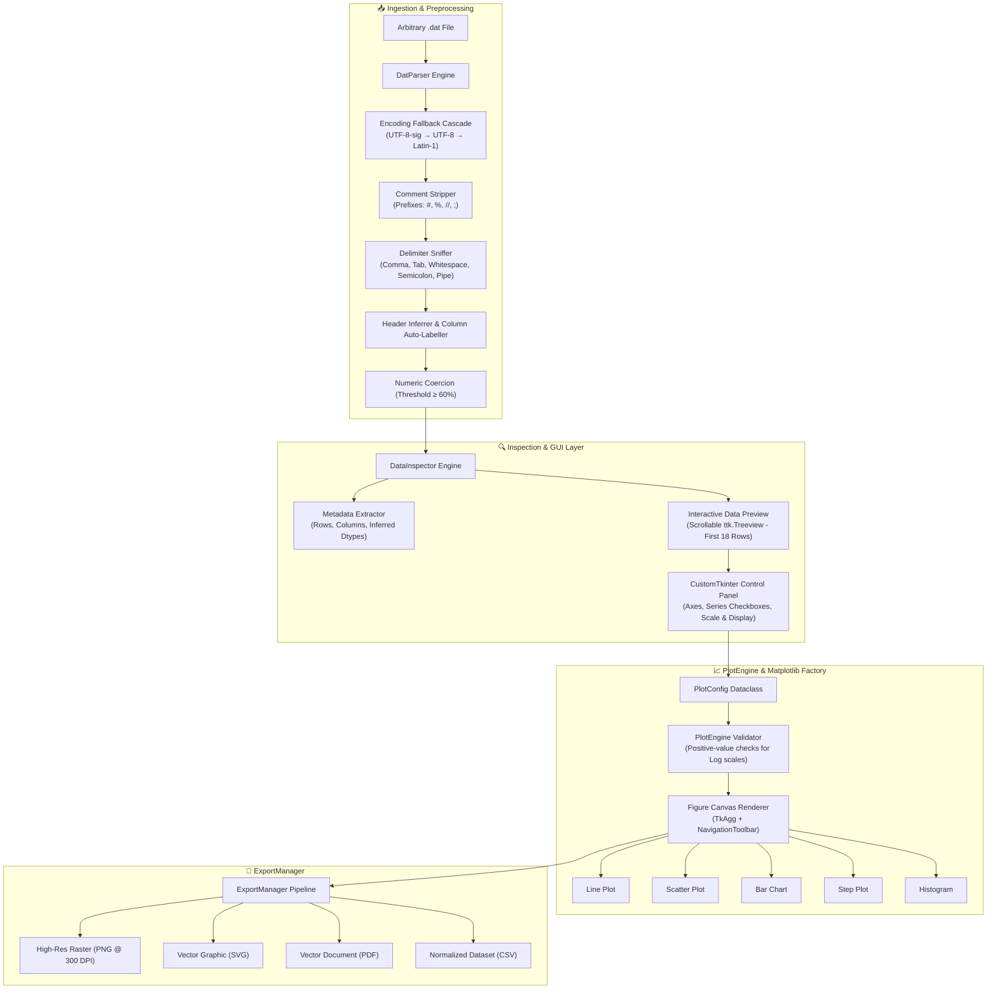

<div align="center">

# 📊 Xplot
### Universal Scientific `.dat` File Inspector & Multi-Axis Plotting Suite

A standalone, zero-configuration Python desktop GUI application engineered for high-throughput exploration, automated delimiter sniffing, metadata inspection, and publication-ready multi-series plotting of arbitrary scientific data files.

[](https://python.org)
[](https://github.com/TomSchimansky/CustomTkinter)
[](https://pandas.pydata.org)
[](https://numpy.org)
[](https://matplotlib.org)
[](LICENSE)
[]()

<br>

<p align="center">
  <a href="#-key-features"><b>Explore Features</b></a> •
  <a href="#-system-architecture"><b>Architecture</b></a> •
  <a href="#-quick-start"><b>Quick Start</b></a> •
  <a href="#-workflow--user-guide"><b>User Guide</b></a> •
  <a href="#-supported-plot-types"><b>Plot Types</b></a> •
  <a href="#-sample-data-suite"><b>Sample Data</b></a> •
  <a href="#-project-structure"><b>Structure</b></a> •
  <a href="#-connect--author"><b>Connect</b></a>
</p>

</div>

---

## 📖 Overview

Scientific workflows routinely output experimental data, simulation trajectories, and instrument telemetry in arbitrary `.dat` files with varying delimiters, inconsistent comment headers, and unexpected encodings. Manually formatting these files before plotting slows down analysis.

**Xplot** solves this friction entirely. Built with **CustomTkinter**, **Pandas**, and **Matplotlib**, Xplot delivers a zero-config, desktop-grade GUI that ingests any `.dat` file, automatically sniffs delimiters and encodings, previews the parsed schema, and provides an interactive canvas for exploratory multi-axis plotting and 300 DPI publication exports.

---

## ✨ Key Features

| Capability | Technical Implementation & User Benefit |
| :--- | :--- |
| **Zero-Config Delimiter Sniffing** | Uses Python `csv.Sniffer` coupled with heuristic frequency voting across commas (`,`), tabs (`\t`), semicolons (`;`), pipes (`\|`), and whitespace fallback (`\s+`). |
| **Resilient Encoding Cascade** | Automatically attempts `utf-8-sig` &rarr; `utf-8` &rarr; `latin-1` with graceful replacement handling, eliminating character encoding errors across legacy laboratory files. |
| **Intelligent Header Inference** | Calculates numeric token ratios per row to auto-detect header lines vs. numerical data. Unlabelled datasets automatically receive indexed `Col_0`, `Col_1`, etc. |
| **Robust Comment Stripping** | Automatically ignores leading comment rows marked by `#`, `%`, `//`, or `;`, isolating pure numerical matrices without pre-cleaning. |
| **Live Metadata & Data Preview** | Embedded interactive `ttk.Treeview` displays the first 18 rows of parsed records alongside total row count, column dimensions, and detected column dtypes. |
| **Multi-Series Overlay** | Dynamically generates checkboxes for every numeric column detected in the dataset, allowing arbitrary multi-series overlays on a single canvas. |
| **Dual-Axis Scale Switching** | Independent Linear / Log toggles for both X and Y axes with built-in validation preventing math domain errors on non-positive values. |
| **Publication-Ready Export** | Direct export pipeline supporting 300 DPI high-resolution PNGs, vector SVGs, vector PDFs, and normalized comma-separated CSVs. |
| **Accessible & Responsive UX** | Designed to WCAG 4.5:1 contrast standards with 44px touch targets, clean two-pane layout, custom color cycles, and comprehensive keyboard tab indexing. |

---

## 🏛️ System Architecture

The following diagram illustrates Xplot's modular dataflow—from raw byte ingestion through parsing, schema inspection, interactive rendering, and high-resolution export:



---

## 🚀 Quick Start

### Prerequisites
* **Python 3.9+** installed on your system.

### 1. Clone the Repository
```bash
git clone https://github.com/harinarayana1457-cmyk/Xplot.git
cd Xplot
```

### 2. Create and Activate a Virtual Environment
```bash
# On Windows (PowerShell)
python -m venv venv
.\venv\Scripts\Activate.ps1

# On macOS / Linux
python3 -m venv venv
source venv/bin/activate
```

### 3. Install Dependencies
```bash
pip install -r requirements.txt
```

### 4. Launch Xplot
```bash
python app.py
```

---

## 🖥️ Workflow & User Guide

```
+-----------------------------------------------------------------------------------------+
|                                    Xplot Desktop GUI                                    |
+------------------------------------+----------------------------------------------------+
|  [ Browse .dat File ]              |  Tabs: [ Data Preview (18 rows) ]  [ Plot Canvas ] |
|  File: sinusoidal_comma.dat        |                                                    |
|  Dim:  54 rows x 4 cols            |  [ ttk.Treeview / Matplotlib Figure Canvas ]       |
|                                    |                                                    |
|  X Axis:      [ time          v ]  |  [ Matplotlib Toolbar: Home, Pan, Zoom, Save ]     |
|  Y Series:    [x] voltage          |                                                    |
|               [x] current          |                                                    |
|               [ ] power            |                                                    |
|  Plot Type:   (o) Line  ( ) Scatter|                                                    |
|               ( ) Bar   ( ) Step   |                                                    |
|  Scale:       [ ] Log X  [ ] Log Y |                                                    |
|  [ > Generate Plot ]               |  Export: [ PNG (300 DPI) ] [ SVG ] [ PDF ] [ CSV ] |
+------------------------------------+----------------------------------------------------+
```

1. **Load Data**: Click **Browse .dat File** and select any file. Xplot immediately invokes `DatParser`, displays file metadata (row count, column count), and opens the **Data Preview** tab showing the first 18 parsed records.
2. **Configure Axes**:
   - **X Axis**: Choose any column or select `(index)` to plot against sequential sample indices.
   - **Y Axis**: Check one or more numeric columns to plot simultaneously with distinct, accessible color coding.
3. **Select Plot Archetype**: Choose between **Line**, **Scatter**, **Bar**, **Histogram**, or **Step**.
4. **Customize Coordinates & Visuals**:
   - Toggle **Log X** and **Log Y** scales (validates that data contains strictly positive values).
   - Enable or disable **Grid** lines and **Legend**.
   - Input custom labels for **Title**, **X Label**, and **Y Label**.
5. **Render**: Click **▶ Plot** to generate the graphic inside the Matplotlib canvas.
6. **Interact & Export**:
   - Use the embedded Matplotlib toolbar to zoom in, pan, or reset view limits.
   - Click **PNG**, **SVG**, or **PDF** on the bottom action bar to export publication-ready assets, or export cleaned data via **CSV Data**.

---

## 📊 Supported Plot Types

| Plot Archetype | Primary Use Case | Rendering Characteristics |
| :--- | :--- | :--- |
| **Line Plot** | Continuous time series & continuous parameter sweeps | High-clarity $1.8\text{px}$ lines with $90\%$ alpha and distinct color palette. |
| **Scatter Plot** | Discontinuous measurements, correlation, and cluster inspection | $20\text{pt}$ markers with $75\%$ alpha to expose overlapping point density. |
| **Bar Chart** | Discrete measurements, bin aggregates, and categorised tallies | $0.6$ bar width with balanced contrast borders. |
| **Step Plot** | Digital waveforms, state transitions, and stepwise integration | Exact midpoint step geometry (`where="mid"`) for discrete signal fidelity. |
| **Histogram** | Probability distributions, noise characterization, and spread | Automatic binning (`bins="auto"`) with clean white edge separation. |

---

## 🧪 Sample Data Suite

Xplot ships with sample datasets in `sample_data/` covering diverse scientific format combinations:

| Dataset | Delimiter | Header Present | Comment Marker | Description |
| :--- | :--- | :--- | :--- | :--- |
| `sinusoidal_comma.dat` | Comma (`,`) | Yes (`time,voltage,...`) | `#` | Multi-phase AC sinusoidal waveforms and instantaneous power |
| `spectrum_whitespace.dat` | Whitespace (`\s+`) | No (`Col_0`, `Col_1`) | `%` | Optical emission spectrum with auto-assigned column headers |
| `tabular_tabs.dat` | Tab (`\t`) | Yes | `##` | Kinetic reaction rate telemetry formatted in strict tab stops |
| `semicolon_test.dat` | Semicolon (`;`) | Yes | `;` | European-style semicolon delimited instrumentation logs |

---

## 📁 Project Structure

```
Xplot/
├── app.py                     # Monolithic, highly modular desktop application (1,000+ LOC)
│   ├── DatParser              # Resilient file ingestion, encoding cascade & delimiter sniffer
│   ├── DataInspector          # Schema extraction, column types & preview table generator
│   ├── PlotEngine             # Matplotlib figure builder supporting 5 scientific archetypes
│   ├── ExportManager          # Multi-format exporter (300 DPI PNG, SVG, PDF, CSV)
│   └── AppUI                  # CustomTkinter reactive two-pane desktop interface
├── requirements.txt           # Verified Python runtime dependencies
├── sample_data/               # Test suites covering whitespace, commas, tabs & semicolons
│   ├── semicolon_test.dat
│   ├── sinusoidal_comma.dat
│   ├── spectrum_whitespace.dat
│   └── tabular_tabs.dat
└── README.md                  # Comprehensive technical documentation & user guide
```

---

## 📦 Dependencies

| Package | Minimum Version | Purpose |
| :--- | :--- | :--- |
| [`customtkinter`](https://customtkinter.tomschimansky.com/) | `5.2.2` | Modern, high-DPI desktop windowing and widgets |
| [`pandas`](https://pandas.pydata.org/) | `2.0.0` | High-performance tabular data ingestion and manipulation |
| [`numpy`](https://numpy.org/) | `1.24.0` | Numerical array operations and mathematical primitives |
| [`matplotlib`](https://matplotlib.org/) | `3.7.0` | Publication-grade 2D visualization and canvas rendering |
| [`CTkMessagebox`](https://github.com/Akash-Ramghar/CTkMessagebox) | `2.5` | Native CustomTkinter modal dialogs and alert banners |

---

## 📄 License

Distributed under the **MIT License**. See `LICENSE` for more information.

---

## 🔗 Connect & Author

**Harinarayana Avvari**

[](https://www.linkedin.com/in/harinarayana-avvari-324209341/)
[](https://github.com/harinarayana1457-cmyk)

<div align="center">
  <sub>Engineered with precision for scientific research and rapid data exploration.</sub>
</div>
