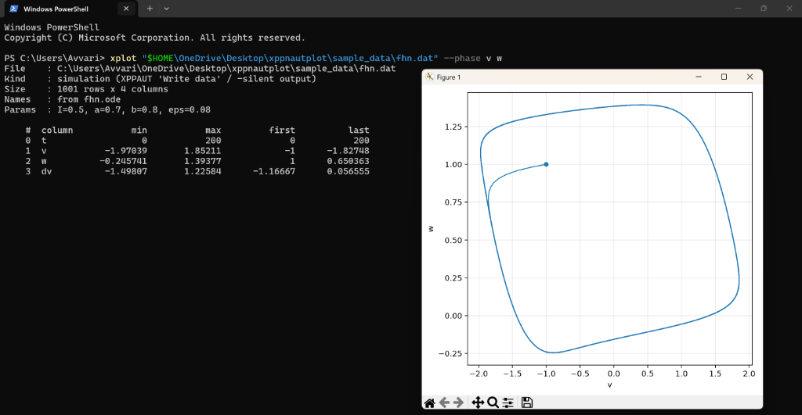
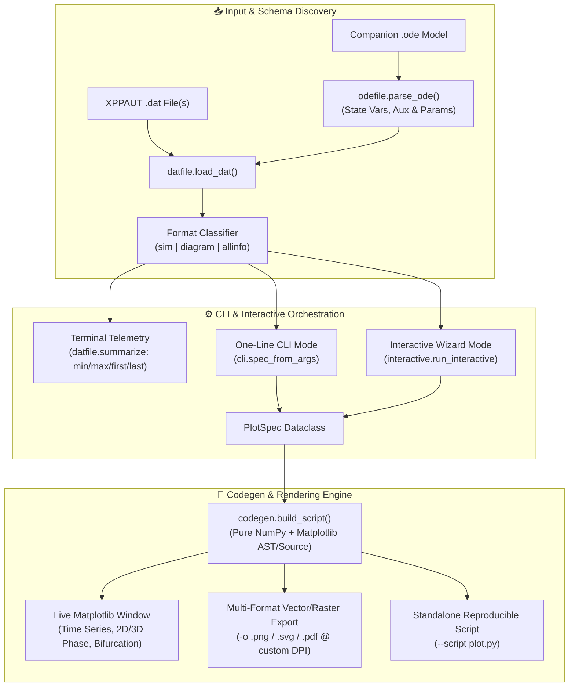

<div align="center">

# 📈 Xplot
### Zero-Boilerplate CLI, Interactive Plotter & Code Generator for XPPAUT `.dat` & AUTO Bifurcation Output

Plot **XPPAUT** dynamical systems simulations and **AUTO** bifurcation diagrams directly from the terminal with a single command—automatically resolving variable names and parameters from companion `.ode` files and optionally exporting standalone Matplotlib scripts.

[](https://python.org)
[](https://numpy.org)
[](https://matplotlib.org)
[]()
[](LICENSE)
[]()

<br>

<p align="center">
  <a href="#-live-preview"><b>Live Preview</b></a> •
  <a href="#-key-features"><b>Key Features</b></a> •
  <a href="#-system-architecture"><b>Architecture</b></a> •
  <a href="#-supported-xppaut--auto-formats"><b>Supported Formats</b></a> •
  <a href="#-installation--quick-start"><b>Quick Start</b></a> •
  <a href="#-cli-usage--examples"><b>CLI Examples</b></a> •
  <a href="#-connect--author"><b>Connect</b></a>
</p>

</div>

---

## 🖥️ Live Preview

```powershell
xplot sample_data/fhn.dat --phase v w
```

<div align="center">
  
  <br>
  <sub><b>Figure 1:</b> Running <code>xplot</code> on a FitzHugh–Nagumo simulation (<code>fhn.dat</code>) automatically parses column names and parameters from <code>fhn.ode</code>, prints summary statistics in the terminal, and renders the limit-cycle phase portrait (<code>w</code> vs. <code>v</code>).</sub>
</div>

---

## 📖 Overview

**XPPAUT** `.dat` files contain raw numerical arrays without header rows, forcing researchers to repeatedly write `numpy.loadtxt` and `matplotlib` boilerplate while manually cross-referencing variable indices against their `.ode` model files.

**Xplot** replaces that workflow with a single command. It automatically locates the matching `.ode` specification, extracts state variables, auxiliary (`aux`) quantities, and model parameters, detects whether the `.dat` file is a **time-domain simulation** or an **AUTO bifurcation continuation**, prints a statistical summary (`min`, `max`, `first`, `last`), and renders publication-ready 2-D/3-D phase portraits, stacked time series, or XPPAUT-styled bifurcation diagrams. When you need fine-grained customization for a manuscript, `--script` exports the exact standalone Python script used to generate the figure.

---

## ✨ Key Features

| Feature | Technical Implementation & Research Workflow Benefit |
| :--- | :--- |
| **🔍 Automatic `.ode` Schema Resolution** | Automatically pairs headerless `.dat` files with their `.ode` source (`run.ode` next to `run.dat`, prefix matching `fhn_allinfo.dat` &rarr; `fhn.ode`, or single `.ode` fallback) to extract variable names, `aux` quantities, and parameter values. |
| **🧠 Smart Format Auto-Detection** | Inspects column geometry and stability markers to distinguish XPPAUT **Simulation** (`Write data` / `-silent`), AUTO **`Write pts`**, and AUTO **`All info`** files automatically. |
| **🌀 2-D & 3-D Phase Portraits** | Plot planar phase portraits (`--phase v w`) with initial-state markers or full 3-D chaotic attractors (`--phase x y z`, e.g., Lorenz system) with interactive rotation. |
| **🌿 Native AUTO Bifurcation Rendering** | Renders equilibria and periodic orbit branches using XPPAUT's canonical color and line-style conventions, supporting two-parameter selection (`--par 1|2`) and period continuation (`-y period`). |
| **🐍 Self-Contained Script Codegen (`--script`)** | Every figure is rendered by compiling and executing a clean `numpy` + `matplotlib` Python script via `codegen.py`. Passing `--script fig.py` saves that standalone file with zero `xplot` runtime dependency. |
| **🧭 Interactive Terminal Menu (`-i`)** | Launching `xplot` without arguments opens an interactive CLI wizard that guides file selection, plot mode, and exports while echoing the equivalent one-line command. |
| **📊 Instant Terminal Telemetry** | Prints dataset dimensions, resolved `.ode` parameter values, and per-column `min`, `max`, `first`, and `last` statistics before opening the canvas (or exclusively via `--info`). |

---

## 🏛️ System Architecture


```mermaid
flowchart TD
    subgraph INPUT ["📥 Input & Schema Discovery"]
        A["XPPAUT .dat File(s)"] --> B["datfile.load_dat()"]
        C["Companion .ode Model"] --> D["odefile.parse_ode()<br>(State Vars, Aux & Params)"]
        D --> B
        B --> E["Format Classifier<br>(sim | diagram | allinfo)"]
    end

    subgraph CLI_LAYER ["⚙️ CLI & Interactive Orchestration"]
        E --> F["Terminal Telemetry<br>(datfile.summarize: min/max/first/last)"]
        E --> G1["One-Line CLI Mode<br>(cli.spec_from_args)"]
        E --> G2["Interactive Wizard Mode<br>(interactive.run_interactive)"]
        G1 & G2 --> H["PlotSpec Dataclass"]
    end

    subgraph CODEGEN ["🐍 Codegen & Rendering Engine"]
        H --> I["codegen.build_script()<br>(Pure NumPy + Matplotlib AST/Source)"]
        I --> J1["Live Matplotlib Window<br>(Time Series, 2D/3D Phase, Bifurcation)"]
        I --> J2["Multi-Format Vector/Raster Export<br>(-o .png / .svg / .pdf @ custom DPI)"]
        I --> J3["Standalone Reproducible Script<br>(--script plot.py)"]
    end
```

---

## 📂 Supported XPPAUT & AUTO Formats

Xplot automatically infers the file structure from its column signature (or accepts `--kind sim|diagram|allinfo` to override):

| Format Kind | XPPAUT / AUTO Origin | Column Layout | Supported Plot Modes |
| :--- | :--- | :--- | :--- |
| **`sim`** | *File &rarr; Write data* or `xppaut -silent` | `t`, state variables (`v, w, ...`), `aux` quantities | Time series, stacked `--subplots`, 2-D `--phase X Y`, 3-D `--phase X Y Z`, multi-file overlays |
| **`diagram`** | AUTO *File &rarr; Write pts* | `par  y_hi  y_lo  type  branch` | 1-parameter bifurcation diagram (`y_hi` / `y_lo` vs. `par`) |
| **`allinfo`** | AUTO *File &rarr; All info* | `type  branch  par1  par2  period  u_hi...  u_lo...  eigenvalues...` | Bifurcation diagram for any state variable (`-y var`), parameter axis selection (`--par 1\|2`), or orbit period (`-y period`) |

### 🎨 AUTO Bifurcation Color Convention

Bifurcation diagrams adhere to XPPAUT's standard stability visual encoding:

| Visual Style | Dynamical Meaning |
| :--- | :--- |
| 🔴 **Red Solid Line** | Stable equilibria (steady states) |
| ⚫ **Black Dashed Line** | Unstable equilibria |
| 🟢 **Green Filled Circles** | Stable periodic orbits (max / min amplitude envelope) |
| 🔵 **Blue Open Circles** | Unstable periodic orbits (max / min amplitude envelope) |

---

## 🚀 Installation & Quick Start

### Prerequisites
* **Python 3.9+** with `numpy>=1.24` and `matplotlib>=3.7`.

### 1. Clone & Install in Editable Mode
```bash
git clone https://github.com/harinarayana1457-cmyk/Xplot.git
cd Xplot
pip install -e .
```
*(Installing with `pip install -e .` registers the global `xplot` command in your environment. You can also invoke `python -m xplot` directly.)*

### 2. Try With Bundled Dynamical Systems Samples
```bash
# 1. FitzHugh-Nagumo limit-cycle phase portrait (2-D)
xplot sample_data/fhn.dat --phase v w

# 2. FitzHugh-Nagumo AUTO Hopf bifurcation diagram
xplot sample_data/fhn_diagram.dat

# 3. Lorenz strange attractor trajectory (3-D)
xplot sample_data/lorenz.dat --phase x y z
```

---

## 💻 CLI Usage & Examples

```bash
# Launch interactive menu wizard
xplot

# Plot every state variable & aux quantity against time t
xplot run.dat

# Plot selected variables in stacked subplots
xplot run.dat -y v w --subplots

# 2-D phase plane (w vs v) and 3-D phase space (x, y, z)
xplot run.dat --phase v w
xplot lorenz.dat --phase x y z

# Overlay a variable across multiple parameter sweeps
xplot I0.5.dat I1.0.dat -y v

# Plot AUTO bifurcation diagram ('Write pts' or 'All info')
xplot diagram.dat
xplot allinfo.dat -y w --par 2
xplot allinfo.dat -y period

# Save high-DPI PNG & vector PDF headlessly without opening a window
xplot run.dat -y v -o fig.png -o fig.pdf --dpi 300 --no-show

# Export a self-contained, editable Python/Matplotlib script
xplot run.dat --phase v w --script phase_plot.py

# Print dataset metadata, .ode parameters, and column statistics only
xplot run.dat --info
```

### ⚙️ Complete CLI Reference

| Option Flag | Description |
| :--- | :--- |
| `--ode FILE` | Explicit `.ode` file to read variable, `aux`, and parameter names from |
| `--names t,v,w` | Comma/space-separated column names (overrides `.ode` auto-detection) |
| `--kind {auto,sim,diagram,allinfo}` | Force file format interpretation instead of auto-detection |
| `-x COL` | X-axis column for time series (default: `0` / `t`) |
| `-y COL [COL ...]` | Y-axis column(s) to plot (by case-insensitive name or 0-based index) |
| `--phase X Y [Z]` | Render 2-D (`X Y`) or 3-D (`X Y Z`) phase portrait |
| `--subplots` | Render each `-y` variable in its own vertically stacked panel |
| `--points` | Plot discrete markers instead of continuous lines |
| `--par {1,2}` | Choose `par1` or `par2` for the horizontal axis on `allinfo` bifurcation diagrams |
| `--title / --xlabel / --ylabel` | Custom figure title and axis labels |
| `--xlim LO HI` / `--ylim LO HI` | Explicit coordinate axis bounds |
| `--logx` / `--logy` | Logarithmic axis scaling |
| `-o, --save FILE` | Save figure to `.png`, `.svg`, or `.pdf` (repeatable for multiple outputs) |
| `--dpi INT` | Output resolution for raster exports (default: `150`) |
| `--script FILE.py` | Emit a standalone `numpy` + `matplotlib` Python script that reproduces the plot |
| `--no-show` | Run headlessly without opening an interactive GUI window |
| `--info` | Print file summary, `.ode` parameters, and column min/max/first/last table only |
| `-q, --quiet` | Suppress terminal summary output |
| `-i, --interactive` | Launch the interactive terminal prompt |

---

## 🧪 Testing

Run the unit test suite covering `.ode` parsing, `.dat` format detection, CLI argument resolution, headless rendering, and standalone script generation:

```bash
python -m unittest discover -s tests -v
```

---

## 📁 Project Structure

```
Xplot/
├── assets/
│   └── xplot_demo.png         # CLI summary + FitzHugh-Nagumo phase portrait screenshot
├── xplot/
│   ├── __init__.py            # Package metadata & version
│   ├── __main__.py            # `python -m xplot` entry point
│   ├── cli.py                 # Argument parser, PlotSpec builder & CLI orchestration
│   ├── interactive.py         # Step-by-step interactive terminal menu
│   ├── datfile.py             # .dat loader, format auto-classifier & statistical summary
│   ├── odefile.py             # .ode parser for state variables, aux quantities & params
│   └── codegen.py             # Standalone NumPy/Matplotlib script generator & runner
├── sample_data/
│   ├── fhn.ode                # FitzHugh-Nagumo excitable neuron ODE definition
│   ├── fhn.dat                # FitzHugh-Nagumo simulation trajectory (1001 x 4)
│   ├── fhn_diagram.dat        # AUTO 'Write pts' Hopf bifurcation diagram
│   ├── fhn_allinfo.dat        # AUTO 'All info' continuation dataset
│   ├── lorenz.ode             # Lorenz chaotic attractor ODE definition
│   ├── lorenz.dat             # 3-D Lorenz simulation trajectory
│   └── make_samples.py        # Numerical generator for sample XPPAUT datasets
├── tests/
│   └── test_xplot.py          # Automated unit test suite
├── pyproject.toml             # PEP 621 package configuration & `xplot` console script
├── requirements.txt           # Runtime dependencies (numpy, matplotlib)
└── README.md                  # Documentation
```

---

## 📄 License

Distributed under the **MIT License**. See `LICENSE` for more information.

---

## 🔗 Connect & Author

**Harinarayana Avvari**

[](https://www.linkedin.com/in/harinarayana-avvari-324209341/)
[](https://github.com/harinarayana1457-cmyk)

<div align="center">
  <sub>Engineered for dynamical systems research, nonlinear dynamics, and bifurcation analysis with XPPAUT & AUTO.</sub>
</div>
